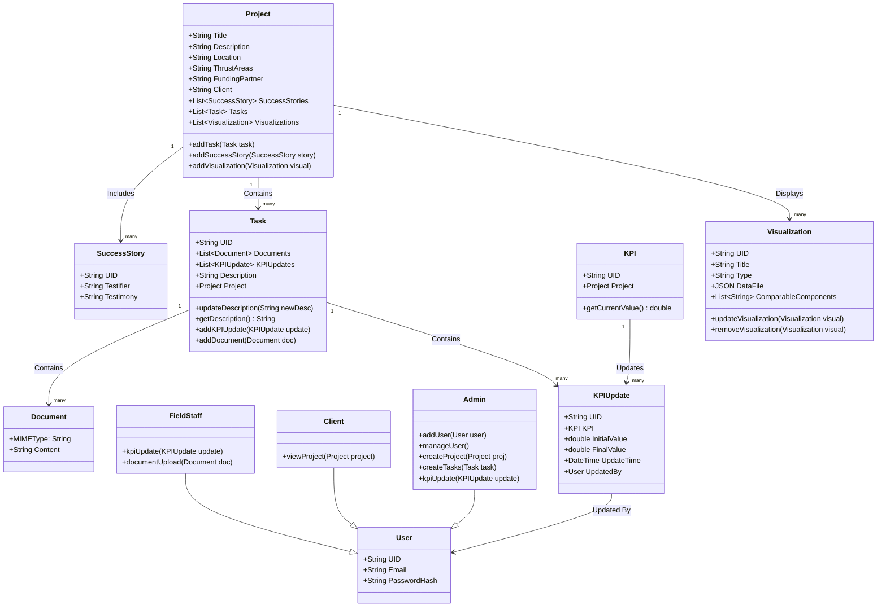

```mermaid
classDiagram

class Project {
  +String Title
  +String Description
  +String Location
  +String ThrustAreas
  +String FundingPartner
  +String Client
  +List~SuccessStory~ SuccessStories
  +List~Task~ Tasks
  +List~Visualization~ Visualizations
  +addTask(Task task)
  +addSuccessStory(SuccessStory story)
  +addVisualization(Visualization visual)
}

class SuccessStory {
  +String UID
  +String Testifier
  +String Testimony
}

class Task {
  +String UID
  +List~Document~ Documents
  +List~KPIUpdate~ KPIUpdates
  +String Description
  +Project Project
  +updateDescription(String newDesc)
  +getDescription() String
  +addKPIUpdate(KPIUpdate update)
  +addDocument(Document doc)
}

class Document {
  +MIMEType: String
  +String Content
}

class KPI {
  +String UID
  +Project Project
  +getCurrentValue() double
}

class KPIUpdate {
  +String UID
  +KPI KPI
  +double InitialValue
  +double FinalValue
  +DateTime UpdateTime
  +User UpdatedBy
}

class Visualization {
  +String UID
  +String Title
  +String Type
  +JSON DataFile
  +List~String~ ComparableComponents
  +updateVisualization(Visualization visual)
  +removeVisualization(Visualization visual)
}

class User {
  +String UID
  +String Email
  +String PasswordHash
}

class FieldStaff {
  +kpiUpdate(KPIUpdate update)
  +documentUpload(Document doc)
}

class Client {
  +viewProject(Project project)
}

class Admin {
  +addUser(User user)
  +manageUser()
  +createProject(Project proj)
  +createTasks(Task task)
  +kpiUpdate(KPIUpdate update)
}

%% Inheritance
FieldStaff --|> User
Client --|> User
Admin --|> User

%% Relationships
Project "1" --> "many" SuccessStory : Includes
Project "1" --> "many" Task : Contains
Project "1" --> "many" Visualization : Displays
Task "1" --> "many" Document : Contains
Task "1" --> "many" KPIUpdate : Contains
KPI "1" --> "many" KPIUpdate : Updates
KPIUpdate --> User : Updated By
```