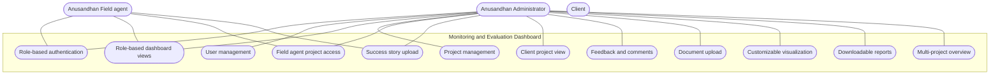

```mermaid
graph TD
  %% Actor nodes
  Admin([Anusandhan Administrator])
  Field([Anusandhan Field agent])
  Client([Client])

  %% Use case group
  subgraph Monitoring and Evaluation Dashboard
    direction TB
    UA([Role-based authentication])
    UM([User management])
    RBD([Role-based dashboard views])
    PM([Project management])
    FAPA([Field agent project access])
    SSU([Success story upload])
    CPV([Client project view])
    FC([Feedback and comments])
    DU([Document upload])
    CV([Customizable visualization])
    DR([Downloadable reports])
    MPO([Multi-project overview])
  end

  %% Admin permissions
  Admin --- UA
  Admin --- UM
  Admin --- RBD
  Admin --- PM
  Admin --- FAPA
  Admin --- SSU
  Admin --- CPV
  Admin --- FC
  Admin --- DU
  Admin --- CV
  Admin --- DR
  Admin --- MPO

  %% Field agent permissions
  Field --- UA
  Field --- RBD
  Field --- FAPA
  Field --- SSU
```